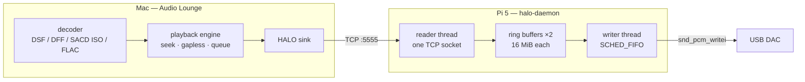
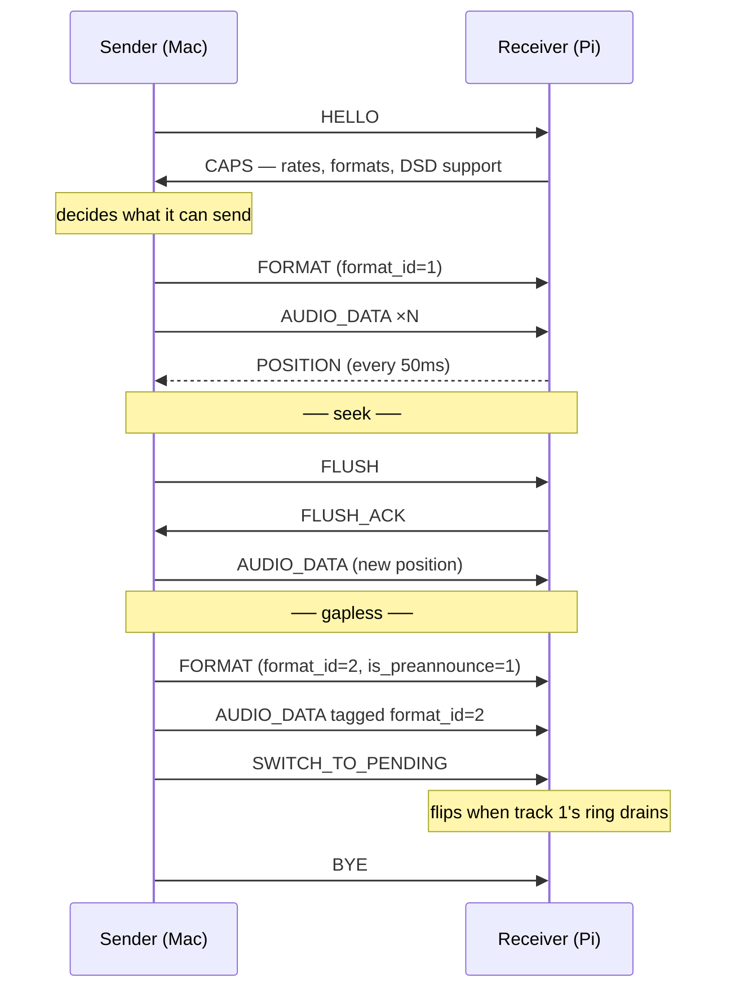
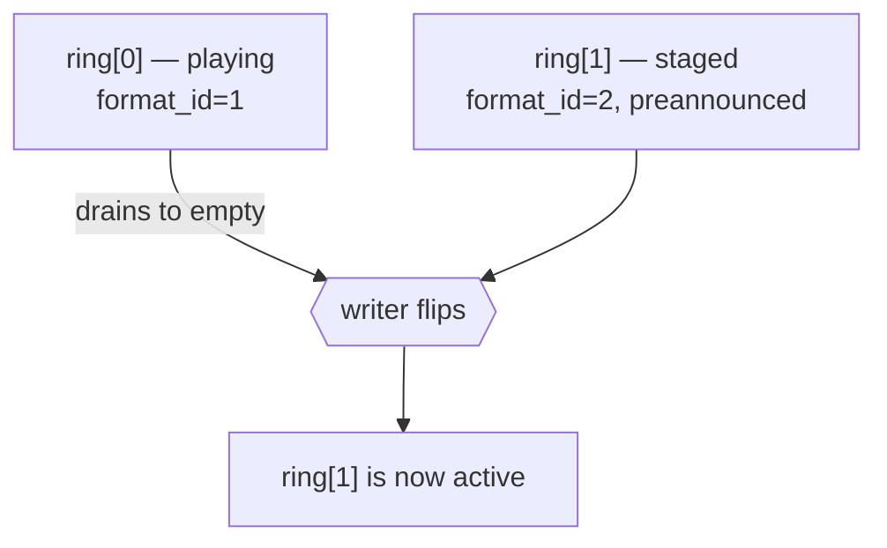
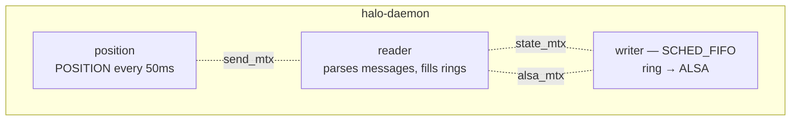

# HALO — how it works

A reading guide, not a specification. `PROTOCOL.md` is normative and says what
the bytes are; this says why they are that way, and what has to be true for
audio to come out the other end. If the two disagree, `PROTOCOL.md` wins.

---

## The one-sentence version

The Mac decodes; the Pi does nothing but hand bytes to a DAC.

Everything below follows from taking that literally. The receiver has no
resampler, no volume control, no format conversion, no mixer, and no opinion
about what it is playing. It is a wire with a buffer in it.

---

## Why not just use what exists

| | why it was not enough |
|---|---|
| **UPnP/DLNA, AirPlay** | the receiver decodes, so the receiver decides — and it resamples, mixes, and reformats without asking |
| **Roon RAAT** | closed |
| **NFS/SMB + an MPD on the Pi** | now the Pi has a library, a decoder, and a scanner; the thing you wanted to keep simple is the thing doing the most work |
| **RTP / AES67 / Dante** | built for many receivers on a managed network, with clock discipline to match. One Pi on a home LAN pays that cost for nothing |

The gap is narrow and specific: *one* sender, *one* receiver, on a LAN, where
the sender already has a bit-perfect decode pipeline and the receiver's only
job is not to touch it.

---

## Shape

Two rings, not one — that is the whole gapless mechanism, and it is explained
below.

---

## The conversation

Every message is a 24-byte header and a payload. One socket carries both
control and audio, which is the source of most of the interesting constraints
— see "the head-of-line problem" below.

---

## The five things that are easy to get wrong

### 1. Two rings, and why the switch is the receiver's to make

Gapless means the next track's first sample follows the previous track's last
sample with nothing in between. The sender knows the boundary is coming; only
the receiver knows when the audio it already holds has actually been *played*.

So the sender preannounces into a second ring and then says "commit"
(`SWITCH_TO_PENDING`), and the receiver flips when the active ring drains to
empty. That drain *is* the "old track finished" event. Nothing else in the
system knows it.

If the two formats differ, the flip also drains ALSA's own buffer and reopens
the device at the new rate. If they match, nothing is reopened and the DAC
never notices a track changed.

A **manual skip** reuses the same machinery with the pending slot filled by a
non-preannounce `FORMAT` — but it discards what was buffered instead of
draining it. Same flip, opposite meaning, which is why the log names them
differently (`gapless switch` vs `hard-cut switch`).

### 2. The unit of `sample_rate` is not always a sample

For PCM it is what you expect. For **native DSD**, one "tick" is one byte per
channel of the 1-bit stream, so `sample_rate = bit_rate / 8` — DSD64 is
2.8224 MHz on the wire and `352800` in the header. For **DoP**, the sender has
already packed the bits into 24-bit PCM containers, so `sample_rate` is the
PCM frame rate: `bit_rate / 16`.

`POSITION.frames_written` counts these same ticks. Getting this wrong is not a
subtle bug — it stalled gapless for seventeen seconds waiting for a boundary
that could not be reached, and separately made the elapsed clock run four
times fast.

### 3. The receiver must not promote formats on its own

A preannounced format sits pending until the sender commits. It is tempting to
let the receiver promote early when the active ring runs dry — and that
deadlocks: the receiver starts reporting `POSITION` for a `format_id` the
sender still considers pending, the sender discards those reports as stale,
and both sides wait for the other.

### 4. The head-of-line problem

Control and audio share one TCP stream and one serial reader. Anything that
blocks the reader blocks *everything*, including the message that would
unblock it. Two real deadlocks came from this:

- **Paused and overfull.** While paused the writer stops, so the ring never
  drains; a sender that keeps pushing fills it; the reader blocks trying to
  place the bytes — and the reader is what delivers `RESUME`. Fixed by
  spilling overflow to a heap buffer so the reader can always reach the next
  message, never by blocking.
- **A peer that stops reading.** The daemon's own sends block once the peer's
  window closes, holding the send lock the reader needs for its replies. Every
  blocking I/O path is therefore bounded, and giving up means closing the
  connection — a partial message cannot be resynchronised.

### 5. An unstarted device cannot underrun

After a seek the receiver has dropped everything and the sender is busy
re-seeking its decoder — 250-600ms on real material. Start the DAC on the few
milliseconds that arrive first and it plays them, starves, and reports a
dropout. Every seek. So the writer waits for ~300ms *in the ring* before it
hands ALSA anything.

This costs nothing in latency, which is the part worth understanding: the
silence lasts exactly as long as the sender takes either way. The audio
arrives in a burst, so the cushion fills in milliseconds once it starts.
Waiting on a *start threshold* instead cannot work — no threshold covers a
600ms gap without also making every seek wait 600ms.

---

## Threads, and what each may touch

Three locks, and the separation matters:

- **`state_mtx`** guards routing state — which ring is active, what format it
  holds. Never held across an ALSA call.
- **`alsa_mtx`** guards the device handle itself. Without it, the reader's
  `snd_pcm_drop` (every seek) races the writer inside `snd_pcm_writei`; drop
  leaves the stream in `SETUP`, a write in that state returns `-EBADFD`, and
  the writer treats that as fatal. Playback dies on the first seek.
- **`send_mtx`** serialises replies.

The rule that keeps it deadlock-free: `alsa_mtx` is never acquired while
holding `state_mtx`.

---

## What the sender must do

The receiver is deliberately dumb, so these are not suggestions:

- **Check CAPS before sending.** No downmix, no resample, no format
  negotiation happens on the receiver. A 6-channel track to a stereo DAC is
  the sender's problem to solve or refuse.
- **Bound lookahead in bytes.** The ring is finite; "a few seconds" is not a
  byte count, and at DSD512 the difference is large enough to fill it.
- **Never send `AUDIO_DATA` between `FLUSH` and `FLUSH_ACK`.** Undefined, and
  in practice it means fragments of the pre-seek position after the seek.
- **`format_id` strictly increases**, including for back-to-back identical
  formats. It is how the receiver tells stale audio from current.

---

## Deliberately absent

No volume, no resampling, no format conversion, no encryption, no multi-room,
no clock discipline, no reconnect-and-resume. Each of these is a decision that
belongs to whoever owns the music, and the receiver does not.

The one that surprises people is **volume**: adding it would mean the receiver
modifying samples, which is the one thing the whole design exists to prevent.
Use the DAC's own attenuator.

---

## Where to read next

| | |
|---|---|
| `PROTOCOL.md` | normative — wire format, message semantics, edge cases |
| `README.md` | operating it: install, journal, per-DAC tuning |
| `src/main.c` | reader thread, ring routing, gapless flip |
| `src/alsa_output.c` | device open, DSD repacking, drain |
| `tools/` | the regression tests, each named for the bug it pins down |
